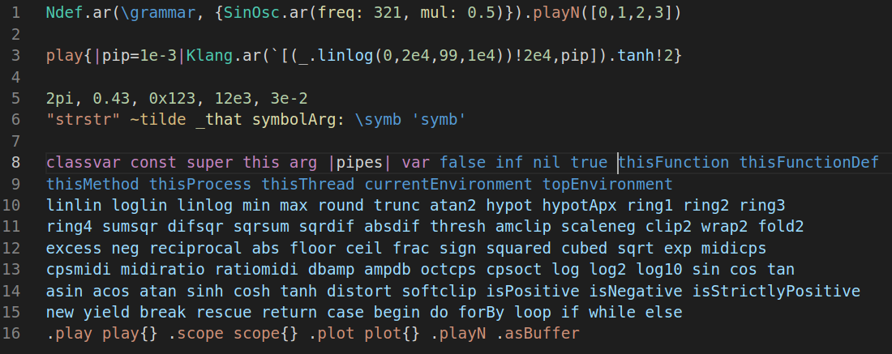
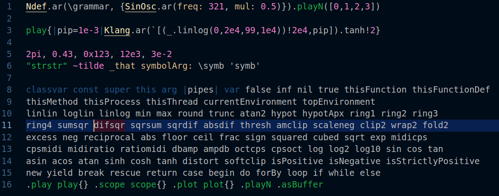
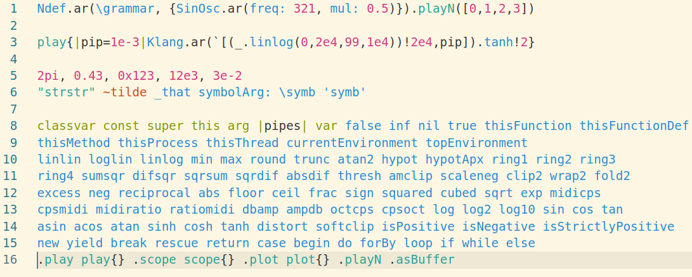

# SuperCollider text highlighting for VS Code

SuperCollider syntax grammars for VSCode

the language-supercollider extension is an enhanced flavor of [SuperCollider](https://supercollider.github.io/) syntax highlighting for [VS Code](https://code.visualstudio.com/).

converted from the supercollider-source with some additions
https://github.com/supercollider/supercollider/blob/develop/HelpSource/editor.js

install from [Visual Studio Code Marketplace](https://marketplace.visualstudio.com/vscode) or clone/place this repo in ~\.vscode\extensions\

[SuperCollider](https://supercollider.github.io/) is a programming language for real time audio synthesis and algorithmic composition.

The language (sclang) communicates via Open Sound Control with one or more synthesis servers. The SuperCollider synthesis server runs in a separate process or even on a separate machine so it is ideal for realtime networked music.

This extensions does not include any REPL (language shell) or interaction with sclang. This is just for editing SuperCollider code.

Possibly redundant; this extension is tested on Linux (Debian, Ubuntu), MacOs and Windows.

**Enjoy!**

## Known Issues

At the publishing moment non is known. If you find any please open an issue in the github repo

## Release Notes

### 0.0.1

beginnings

### 0.0.2

barely working

### 0.0.3

working okay, soon to release

### 0.0.4

publish to visual studio marketplace

### 0.0.5

added working $ (char) pattern,
fixed single quote symbol bug ('symbol'),
fixed keyword bug (ex. this.)
fixed multiline comment bug

---------------------------------------------------------------------------------------
