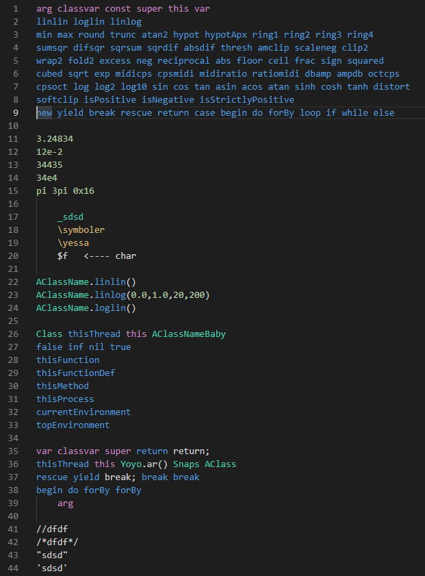

## SuperCollider syntax for Visual Studio Code
this extension does the minimum needed sc highlighting correct

place in ~\.vscode\extensions\

## Known Issues

quite alot, not collecting correctly i.e. break; return;

## Release Notes

### 0.0.1

not working

### 0.0.2

barely working

### 0.0.3

okay, soon to release

---------------------------------------------------------------------------------------

**Enjoy!**